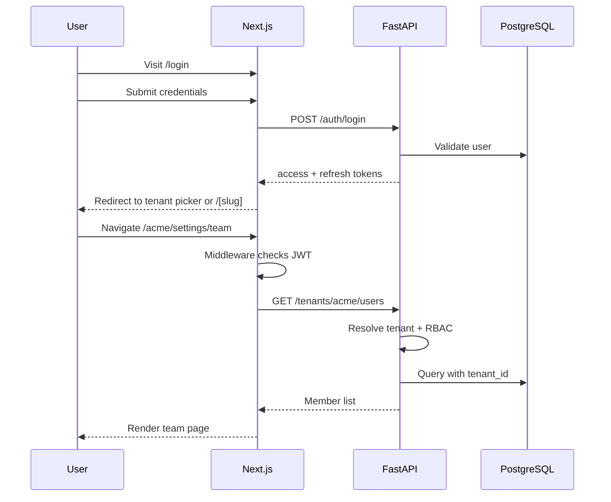

# Route Map

## API Base URL

```
Production:  https://api.nexora.app/api/v1
Development: http://localhost:8000/api/v1
```

## FastAPI Routes

### Health & Meta

| Method | Path | Auth | Description |
|--------|------|------|-------------|
| GET | `/health` | Public | Liveness check |
| GET | `/api/v1/meta` | Public | API version, build info |

---

### Authentication (`/api/v1/auth`)

| Method | Path | Auth | Description |
|--------|------|------|-------------|
| POST | `/auth/register` | Public | Create user account |
| POST | `/auth/login` | Public | Email + password → tokens |
| POST | `/auth/refresh` | Refresh token | Rotate access token |
| POST | `/auth/logout` | Bearer | Revoke refresh token |
| POST | `/auth/forgot-password` | Public | Send reset email |
| POST | `/auth/reset-password` | Public | Reset with token |
| POST | `/auth/verify-email` | Public | Verify email token |
| GET | `/auth/me` | Bearer | Current user profile |

---

### Tenants (`/api/v1/tenants`)

| Method | Path | Auth | Permission | Description |
|--------|------|------|------------|-------------|
| POST | `/tenants` | Bearer | — | Create new tenant (onboarding) |
| GET | `/tenants` | Bearer | — | List tenants for current user |
| GET | `/tenants/{slug}` | Bearer | `tenant:read` | Tenant details |
| PATCH | `/tenants/{slug}` | Bearer | `tenant:write` | Update tenant name/status |
| DELETE | `/tenants/{slug}` | Bearer | `tenant:delete` | Archive tenant (owner only) |

---

### Users & Membership (`/api/v1/tenants/{slug}/users`)

| Method | Path | Auth | Permission | Description |
|--------|------|------|------------|-------------|
| GET | `/tenants/{slug}/users` | Bearer | `user:read` | List members |
| GET | `/tenants/{slug}/users/{id}` | Bearer | `user:read` | Member detail |
| PATCH | `/tenants/{slug}/users/{id}` | Bearer | `user:write` | Update role/status |
| DELETE | `/tenants/{slug}/users/{id}` | Bearer | `user:delete` | Remove member |

---

### Invitations (`/api/v1/tenants/{slug}/invitations`)

| Method | Path | Auth | Permission | Description |
|--------|------|------|------------|-------------|
| GET | `/tenants/{slug}/invitations` | Bearer | `invitation:read` | List pending invites |
| POST | `/tenants/{slug}/invitations` | Bearer | `invitation:write` | Send invite |
| DELETE | `/tenants/{slug}/invitations/{id}` | Bearer | `invitation:delete` | Revoke invite |
| POST | `/invitations/accept` | Bearer | — | Accept invite by token |

---

### Roles & Permissions (`/api/v1/tenants/{slug}/roles`)

| Method | Path | Auth | Permission | Description |
|--------|------|------|------------|-------------|
| GET | `/tenants/{slug}/roles` | Bearer | `role:read` | List roles |
| GET | `/permissions` | Bearer | — | Global permission catalog |

---

### Settings (`/api/v1/tenants/{slug}/settings`)

| Method | Path | Auth | Permission | Description |
|--------|------|------|------------|-------------|
| GET | `/tenants/{slug}/settings` | Bearer | `settings:read` | All settings |
| GET | `/tenants/{slug}/settings/{key}` | Bearer | `settings:read` | Single setting |
| PUT | `/tenants/{slug}/settings/{key}` | Bearer | `settings:write` | Upsert setting |

---

### Audit (`/api/v1/tenants/{slug}/audit-logs`)

| Method | Path | Auth | Permission | Description |
|--------|------|------|------------|-------------|
| GET | `/tenants/{slug}/audit-logs` | Bearer | `audit:read` | Paginated audit log |

---

### Platform Admin (`/api/v1/platform`) — Future

| Method | Path | Auth | Description |
|--------|------|------|-------------|
| GET | `/platform/tenants` | Super-admin | All tenants |
| PATCH | `/platform/tenants/{id}/status` | Super-admin | Suspend / activate |

---

## Next.js App Routes

### Public / Marketing

| URL | File | Description |
|-----|------|-------------|
| `/` | `app/(marketing)/page.tsx` | Landing page |

### Authentication

| URL | File | Description |
|-----|------|-------------|
| `/login` | `app/(auth)/login/page.tsx` | Sign in |
| `/register` | `app/(auth)/register/page.tsx` | Sign up |
| `/forgot-password` | `app/(auth)/forgot-password/page.tsx` | Request reset |
| `/reset-password` | `app/(auth)/reset-password/page.tsx` | Set new password |
| `/verify-email` | `app/(auth)/verify-email/page.tsx` | Email verification |

### Onboarding

| URL | File | Description |
|-----|------|-------------|
| `/create-tenant` | `app/(onboarding)/create-tenant/page.tsx` | First workspace setup |
| `/accept-invite/[token]` | `app/(onboarding)/accept-invite/[token]/page.tsx` | Join via invite |

### Tenant App (authenticated)

| URL | File | Description |
|-----|------|-------------|
| `/[tenantSlug]` | `app/(tenant)/[tenantSlug]/page.tsx` | Dashboard shell |
| `/[tenantSlug]/settings` | `.../settings/page.tsx` | Tenant settings |
| `/[tenantSlug]/settings/profile` | `.../settings/profile/page.tsx` | User profile |
| `/[tenantSlug]/settings/team` | `.../settings/team/page.tsx` | Team & invites |
| `/[tenantSlug]/settings/security` | `.../settings/security/page.tsx` | Sessions, password |
| `/[tenantSlug]/unauthorized` | `.../unauthorized/page.tsx` | 403 page |

### Platform Admin — Future

| URL | File | Description |
|-----|------|-------------|
| `/admin/tenants` | `app/(platform)/admin/tenants/page.tsx` | Super-admin panel |

---

## Route Flow Diagram



## Middleware Rules (Frontend)

| Condition | Action |
|-----------|--------|
| No token + protected route | Redirect → `/login` |
| Valid token + auth route | Redirect → last tenant or picker |
| Wrong tenant slug | Redirect → `/unauthorized` or tenant picker |
| Subdomain `acme.nexora.app` | Rewrite to `/acme/*` |

## JWT Claims (Access Token)

```json
{
  "sub": "user-uuid",
  "email": "user@example.com",
  "tenant_id": "tenant-uuid",
  "tenant_slug": "acme",
  "role": "admin",
  "permissions": ["user:read", "settings:write"],
  "exp": 1234567890
}
```
