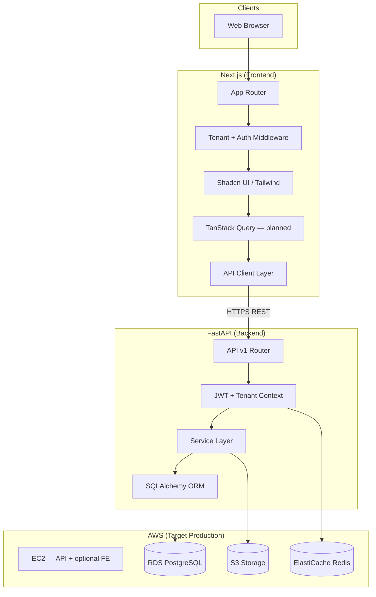
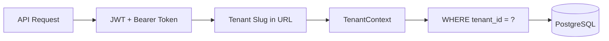
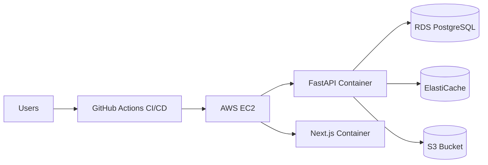

# Nexora CRM Architecture

## Overview

Nexora CRM is a multi-tenant SaaS CRM platform designed for organizations to manage leads, contacts, deals, activities, and team collaboration.

---

## Tech Stack

### Frontend

| Technology | Status |
|------------|--------|
| Next.js 15+ | ✅ Implemented |
| TypeScript | ✅ Implemented |
| Tailwind CSS | ✅ Implemented |
| Shadcn UI | ✅ Implemented (custom components) |
| TanStack Query | 🔜 Planned — server state & caching |

### Backend

| Technology | Status |
|------------|--------|
| FastAPI | ✅ Implemented |
| SQLAlchemy | ✅ Implemented |
| JWT Authentication | ✅ Implemented (access + refresh tokens) |
| Alembic | ✅ Implemented |

### Database

| Technology | Status |
|------------|--------|
| PostgreSQL | ✅ Implemented (local / RDS-ready) |

### Cache

| Technology | Status |
|------------|--------|
| Redis | 🔜 Phase 2 — sessions, rate limiting, background jobs |

### Storage

| Technology | Status |
|------------|--------|
| AWS S3 | 🔜 Phase 2 — attachments, exports, avatars |

### Deployment

| Technology | Status |
|------------|--------|
| Docker | ✅ Dockerfile + docker-compose (dev) |
| GitHub Actions | 🔜 Planned — CI/CD pipelines |
| AWS EC2 | 🔜 Planned — production hosting |

---

## System Diagram

---

## Multi-Tenant Strategy

**Shared database + `tenant_id` on every business table.**

| Rule | Implementation |
|------|----------------|
| Every tenant-scoped table has `tenant_id` | ✅ `tenants`, `leads`, `deals`, memberships, etc. |
| All queries filter by `tenant_id` | ✅ Service layer + `TenantContext` dependency |
| Tenant resolved from URL slug + JWT | ✅ `/{tenantSlug}/*` routes |
| Subdomain routing (`acme.nexora.app`) | 🔜 Planned |

---

## User Roles

### Target role model

| Role | Scope | Description |
|------|-------|-------------|
| **Super Admin** | Platform | Manages all organizations, system config |
| **Organization Admin** | Tenant | Full org control — users, settings, all CRM data |
| **Manager** | Tenant | Team oversight — reports, assign deals, manage pipeline |
| **Sales Executive** | Tenant | Day-to-day CRM — own leads, deals, activities |

### Current implementation (interim)

| Target Role | Current Slug | Notes |
|-------------|--------------|-------|
| Super Admin | `is_super_admin` flag on `users` | Platform routes not built yet |
| Organization Admin | `owner`, `admin` | Mapped via RBAC permissions |
| Manager | — | 🔜 To be added |
| Sales Executive | `member` | Read/write on leads & deals |

> Role migration to the four-tier model is planned in a future RBAC phase.

---

## Module Status

| Module | Backend | Frontend | Notes |
|--------|---------|----------|-------|
| Auth (login, register, JWT) | ✅ | ✅ | Refresh token rotation |
| Organizations (tenants) | ✅ | ✅ | Create, list, slug routing |
| Team management | ✅ | ✅ | Add, role change, remove |
| Leads | ✅ | ✅ | CRUD, search, filters, pagination |
| Deals (Kanban) | ✅ | ✅ | 6 stages, drag-and-drop |
| Contacts | 🔜 | 🔜 | Phase 7 |
| Activities & Tasks | 🔜 | 🔜 | Phase 7 |
| Audit logs | 🔜 | 🔜 | Schema designed |
| Billing | 🔜 | 🔜 | Out of scope |
| Analytics | 🔜 | 🔜 | Out of scope |

---

## Deployment Architecture (Target)

| Environment | Stack |
|-------------|-------|
| **Development** | Local PostgreSQL, `uvicorn --reload`, `npm run dev` |
| **Staging** | Docker on EC2, RDS, GitHub Actions deploy |
| **Production** | EC2 + ALB, RDS Multi-AZ, Redis, S3, GitHub Actions |

---

## Security

- JWT access tokens (15 min) + revocable refresh tokens
- RBAC permission checks on every tenant-scoped endpoint
- CORS restricted to frontend origin
- Password hashing (bcrypt)
- Tenant isolation enforced at service layer (defense in depth)

---

## Related Docs

- [Folder Structure](./folder-structure.md)
- [Database Schema](../database/schema.md)
- [API Route Map](../api/route-map.md)
- [Roadmap](../roadmap.md)
