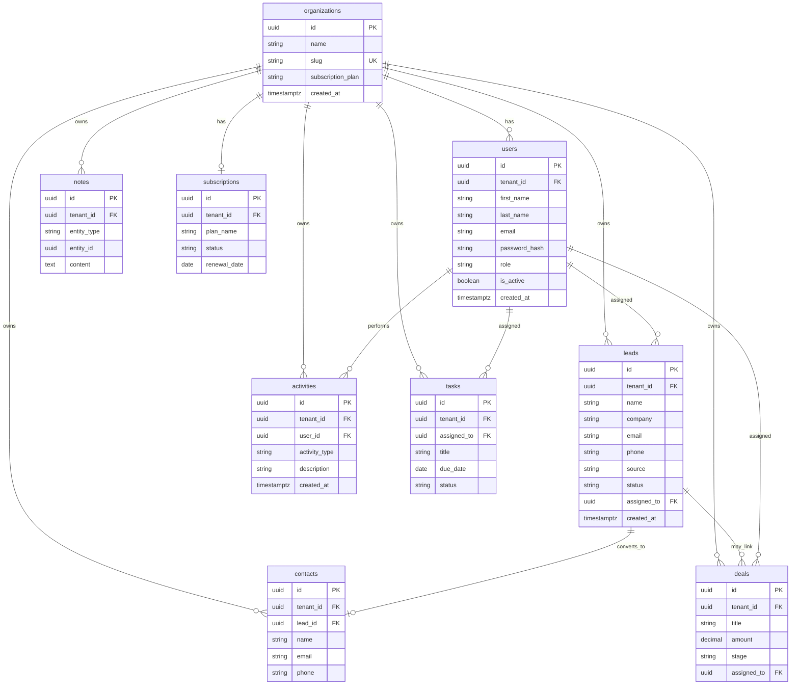

# Nexora CRM Database Schema

Canonical CRM data model. All business tables include `tenant_id` for multi-tenant isolation.

---

## ER Diagram (Target)



---

## Tables

### Organizations

| Column | Type | Notes |
|--------|------|-------|
| id | UUID | Primary key |
| name | VARCHAR(255) | Display name |
| slug | VARCHAR(100) | Unique URL identifier |
| subscription_plan | VARCHAR(50) | e.g. `free`, `pro`, `enterprise` |
| created_at | TIMESTAMPTZ | |

---

### Users

| Column | Type | Notes |
|--------|------|-------|
| id | UUID | Primary key |
| tenant_id | UUID | FK → organizations |
| first_name | VARCHAR(100) | |
| last_name | VARCHAR(100) | |
| email | VARCHAR(320) | Unique per tenant or globally |
| password_hash | VARCHAR(255) | bcrypt |
| role | VARCHAR(50) | `org_admin`, `manager`, `sales_executive` |
| is_active | BOOLEAN | |
| created_at | TIMESTAMPTZ | |

---

### Leads

| Column | Type | Notes |
|--------|------|-------|
| id | UUID | Primary key |
| tenant_id | UUID | FK → organizations |
| name | VARCHAR(255) | Contact / lead name |
| company | VARCHAR(255) | |
| email | VARCHAR(320) | |
| phone | VARCHAR(50) | |
| source | VARCHAR(50) | `website`, `referral`, etc. |
| status | VARCHAR(30) | `new`, `contacted`, `qualified`, … |
| assigned_to | UUID | FK → users |
| created_at | TIMESTAMPTZ | |

---

### Contacts

| Column | Type | Notes |
|--------|------|-------|
| id | UUID | Primary key |
| tenant_id | UUID | FK → organizations |
| lead_id | UUID | FK → leads (nullable — converted lead) |
| name | VARCHAR(255) | |
| email | VARCHAR(320) | |
| phone | VARCHAR(50) | |

---

### Deals

| Column | Type | Notes |
|--------|------|-------|
| id | UUID | Primary key |
| tenant_id | UUID | FK → organizations |
| title | VARCHAR(255) | |
| amount | NUMERIC(14,2) | Deal value |
| stage | VARCHAR(30) | `new`, `qualified`, `proposal`, `negotiation`, `won`, `lost` |
| assigned_to | UUID | FK → users |

---

### Activities

| Column | Type | Notes |
|--------|------|-------|
| id | UUID | Primary key |
| tenant_id | UUID | FK → organizations |
| user_id | UUID | FK → users (who logged it) |
| activity_type | VARCHAR(50) | `call`, `email`, `meeting`, `note` |
| description | TEXT | |
| created_at | TIMESTAMPTZ | |

---

### Tasks

| Column | Type | Notes |
|--------|------|-------|
| id | UUID | Primary key |
| tenant_id | UUID | FK → organizations |
| assigned_to | UUID | FK → users |
| title | VARCHAR(255) | |
| due_date | DATE | |
| status | VARCHAR(30) | `pending`, `in_progress`, `completed` |

---

### Notes

Polymorphic notes attachable to any CRM entity.

| Column | Type | Notes |
|--------|------|-------|
| id | UUID | Primary key |
| tenant_id | UUID | FK → organizations |
| entity_type | VARCHAR(50) | `lead`, `contact`, `deal` |
| entity_id | UUID | ID of the related record |
| content | TEXT | |

---

### Subscriptions

| Column | Type | Notes |
|--------|------|-------|
| id | UUID | Primary key |
| tenant_id | UUID | FK → organizations (one active per org) |
| plan_name | VARCHAR(50) | |
| status | VARCHAR(30) | `active`, `cancelled`, `past_due` |
| renewal_date | DATE | |

---

## Implementation Status

| Table | Status | Current table / notes |
|-------|--------|----------------------|
| **Organizations** | ✅ Partial | `tenants` — missing `subscription_plan` |
| **Users** | ✅ Different model | Global `users` + `tenant_memberships` (see below) |
| **Leads** | ✅ Partial | `leads` — uses `first_name`/`last_name` instead of `name` |
| **Contacts** | 🔜 Not built | — |
| **Deals** | ✅ Partial | `deals` — `value`/`currency` instead of `amount`; has extra fields |
| **Activities** | 🔜 Not built | — |
| **Tasks** | 🔜 Not built | — |
| **Notes** | 🔜 Not built | Inline `notes` on leads/deals today |
| **Subscriptions** | 🔜 Not built | — |

---

## Current vs Target — Key Differences

### Users & roles

Your spec places `tenant_id` and `role` directly on `users`. The current implementation uses a **more flexible multi-tenant pattern**:

```
users (global identity, one email)
  └── tenant_memberships (user ↔ organization)
        └── roles + permissions (RBAC per org)
```

This allows one person to belong to **multiple organizations** with different roles. Migration path: map `role` enum → `roles.slug` (`org_admin` → `owner`/`admin`, `sales_executive` → `member`).

### Organizations

| Target | Current `tenants` |
|--------|-------------------|
| `subscription_plan` | Not yet — use `subscriptions` table or add column |
| `created_at` | ✅ `created_at`, `updated_at` |
| — | `status` (`active`, `suspended`) — extra |

### Leads

| Target | Current `leads` |
|--------|-----------------|
| `name` | `first_name` + `last_name` |
| `assigned_to` | `assigned_to_id` ✅ |
| — | Extra: `job_title`, `estimated_value`, `notes` |

### Deals

| Target | Current `deals` |
|--------|-----------------|
| `amount` | `value` + `currency` |
| `stage` | ✅ Same 6 stages |
| `assigned_to` | `assigned_to_id` ✅ |
| — | Extra: `position` (Kanban ordering), `description`, `lead_id` |

---

## Auth & Platform Tables (Implemented)

These support the foundation but are not in the CRM entity list above:

| Table | Purpose |
|-------|---------|
| `tenant_memberships` | User ↔ organization link |
| `roles` | Per-tenant role definitions |
| `permissions` | Global permission catalog |
| `role_permissions` | Role ↔ permission mapping |
| `refresh_tokens` | JWT refresh token storage |
| `invitations` | Pending team invites (planned) |
| `tenant_settings` | Key-value org config (planned) |
| `audit_logs` | Audit trail (planned) |

---

## Multi-Tenancy Rules

1. Every CRM table **must** include `tenant_id`.
2. Application layer always filters by `tenant_id` from authenticated context — never trust client input alone.
3. Foreign keys (`assigned_to`, `lead_id`, etc.) must belong to the **same tenant**.
4. Indexes: `(tenant_id)`, `(tenant_id, status)`, `(tenant_id, created_at)` on high-traffic tables.

---

## Migration Roadmap

| Migration | Description |
|-----------|-------------|
| `004` | Add `subscription_plan` to `tenants` OR create `subscriptions` table |
| `005` | Create `contacts` table |
| `006` | Create `activities` table |
| `007` | Create `tasks` table |
| `008` | Create `notes` table (polymorphic) |
| Future | Align `leads.name` / `deals.amount` naming if desired |

---

## Related Docs

- [Architecture Overview](../architecture/overview.md)
- [API Route Map](../api/route-map.md)
- [Roadmap](../roadmap.md)
